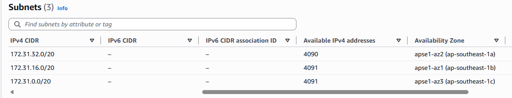
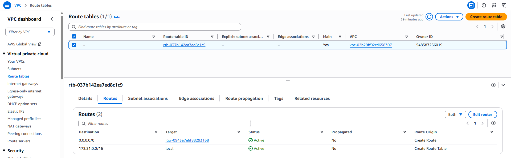
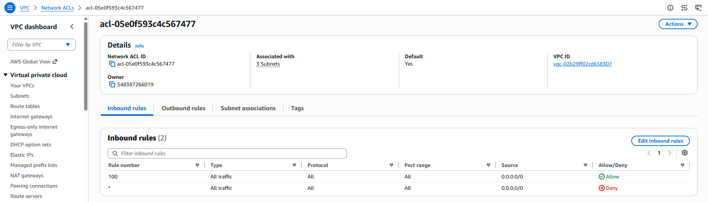
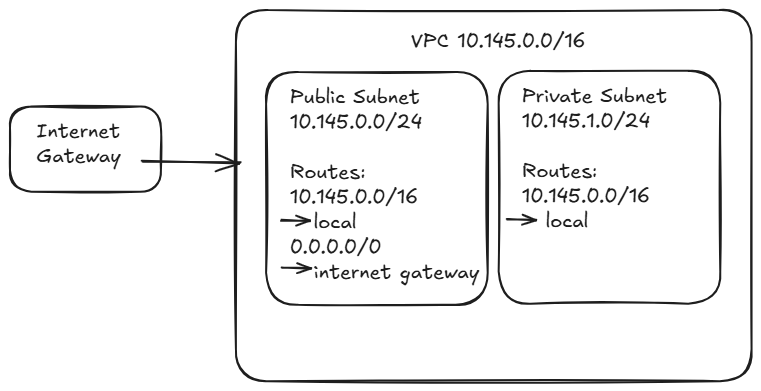

# Assignment 2 Submission

<!--
How to use this template:

1. Copy this file to submissions/assignment-2/<your-github-username>/submission.md
2. Replace every answer placeholder with your own answer. Delete the angle brackets too.
3. Save your four images in the same folder, with the exact file names below.
4. Do not write your full name or your student number in this file.
-->

## About me

- GitHub username: salgadojamesvan
- Section: CCSAD
- IAM user name that I signed in with: ccsad-g03
- X: 145

---

## Part A. Explore

### A1. The VPC

Default VPC IPv4 CIDR:

172.31.0.0/16

Number of addresses in that CIDR:

65,536

### A2. The subnets

| Availability Zone | IPv4 CIDR |
| --- | --- |
| `ap-southeast-1a` | `172.31.32.0/20` |
| `ap-southeast-1b` | `172.31.16.0/20` |
| `ap-southeast-1c` | `172.31.0.0/20` |

Screenshot 1. Save it as `screenshot-1-subnets.png` in your folder. The image line below shows it.

### A3. Available addresses

Available IPv4 addresses in each subnet:

`ap-southeast-1a` 4,090, `ap-southeast-1b` 4,091, `ap-southeast-1c` 4,091.

Why is the number lower than 4,096?

AWS reserves 5 IPv4 addresses in every subnet. A `/20` subnet has 4,096 addresses, so an unused subnet has 4,091 available addresses.

What uses the missing address in the subnet with the lowest number?

`ap-southeast-1a` has one fewer available address than the other subnets. One network interface or AWS resource in that subnet is currently using that address.

### A4. The route table

| Destination | Target |
| --- | --- |
| `0.0.0.0/0` | `igw-0943e7e6f88293168` |
| `172.31.0.0/16` | `local` |

Screenshot 2. Save it as `screenshot-2-routes.png` in your folder. The image line below shows it.

### A5. Public or private

Are the default subnets public or private? Which route proves it?

Public. The route `0.0.0.0/0` sends traffic to the internet gateway.

### A6. The internet gateway

State of the internet gateway:

Attached

What happens to the default subnets if the gateway is detached?

The default subnets would lose their path to the internet because the `0.0.0.0/0` route would no longer have a working internet gateway target. Instances in the VPC could still communicate with each other through the local route.

### A7. NAT gateways

Number of NAT gateways:

0

Can a server in a new private subnet download updates? Why?

No. There is no NAT gateway in the VPC, so a server in a private subnet would not have a route for outbound internet access.

### A8. The network ACL

| Rule number | Source | Allow or Deny |
| --- | --- | --- |
| 100 | `0.0.0.0/0` | Allow |
| `*` | `0.0.0.0/0` | Deny |

How is a network ACL different from a security group?

A network ACL applies to a subnet and is stateless, while a security group applies to a resource and is stateful. A network ACL can also have both allow and deny rules.

Screenshot 3. Save it as `screenshot-3-network-acl.png` in your folder. The image line below shows it.

### A9. The default security group

Inbound rule (type and source):

All traffic, from `sg-0c5b6d4081cf0a534`. The source is the `default` security group itself.

Which resources can send traffic to an instance that uses it?

Resources that also use the `default` security group can send traffic to an instance using this security group.

---

## Part B. Prepare

### B1. Plan two subnets

- Public subnet CIDR: `10.145.0.0/24`
- Private subnet CIDR: `10.145.1.0/24`

### B2. Route tables

Route table of the public subnet:

| Destination | Target |
| --- | --- |
| `10.145.0.0/16` | `local` |
| `0.0.0.0/0` | internet gateway |

Route table of the private subnet:

| Destination | Target |
| --- | --- |
| `10.145.0.0/16` | `local` |

### B3. My VPC diagram

Tool used (Excalidraw, draw.io, Lucidchart, or paper):

Excalidraw

Save your diagram as `vpc-diagram.png` in your folder. The image line below shows it.

### B4. Predict a change

Can you still open the web page from your laptop? Why?

No. Without the `0.0.0.0/0` route to the internet gateway, the instance no longer has a path to the internet. A public IPv4 address alone is not enough.

Can the instance still reach another instance in the VPC? Why?

Yes. The local route for `172.31.0.0/16` is still present, so instances inside the same VPC can still communicate with each other.

### B5. Place a database

Which subnet gets the database? Why?

The database should be placed in the private subnet, `10.145.1.0/24`, because it has no direct route to the internet gateway and should not be directly reachable from the internet.

### B6. My question about VPCs

What is your question, and what made you think of it?

Can two VPCs communicate with each other, and what is needed to connect them?
